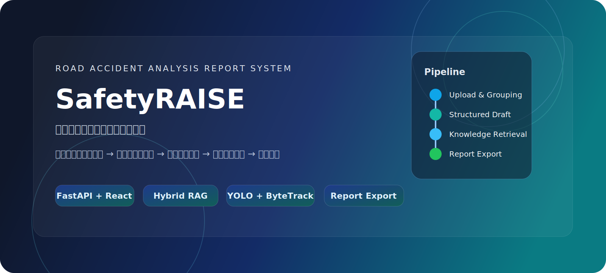

# SafetyRAISE



道路交通事故分析报告生成系统。

SafetyRAISE 面向道路交通事故分析场景，提供从事故图片、视频材料到结构化事故信息、专家指导意见、检索增强报告和文书导出的完整处理链路。仓库适合需要本地联调、私有部署或二次开发该流程的工程团队。

文档索引：

1. 本地启动： [快速开始](docs/quickstart.md)
2. 配置模型、知识库与上传限制： [配置说明](docs/configuration.md)
3. 运行时资产说明： [运行资产准备](docs/prepare-runtime-assets.md)
4. 服务器部署： [部署说明](docs/deployment.md)

## 核心能力

1. 固定八个分组的资料编排台，用于统一整理事故材料并生成事故草稿。
2. 上传限制如下：
   - 每组最多 `20` 张图片、`5` 个视频
   - 单张图片最多 `10MB`
   - 单个视频最多 `100MB`
   - 全部分组最多 `120` 张图片、`20` 个视频
   - 总上传大小最多 `1GB`
3. 视频处理链路完整接入 `YOLO + ByteTrack + 自适应抽帧 + 视觉模型`。
4. 报告链路固定为 `generate_guidance -> retrieve_knowledge(hybrid_local) -> generate_report(agentic RAG) -> postprocess`。
5. 中间产物支持预览，包含：
   - 知识片段
   - 模型自主搜索关键词
   - YOLO 完整输出
   - 结构化事故信息
   - 图片与关键帧
6. 报告/视觉/嵌入模型按「每用户能力配置」解析：
   - 普通用户：视觉/报告必须自填；嵌入留空才回退管理员，一旦自己填写就只用自己的
   - 专家模型固定为系统统一配置，不进入用户配置项
   - 前端填 `url + key + model` 后直接写库，`api_key` 脱敏存储；系统报告端点收敛为单一端点，旧的 `max / pro / lite` 档位已下线
7. 后端支持 `report.md / report.docx / report.pdf` 导出。
8. 内置用户体系：用户名密码登录 + 注册、管理员/普通用户角色、仅管理员可见的用户与空间管理控制台。
9. 会话隔离按登录账户收口：管理员不会在主会话列表看到普通用户会话，前端本地缓存也按用户分桶，切账号不串会话列表。

## 处理链路

```text
事故图片/视频材料
    -> 事故信息草稿
    -> 专家指导意见
    -> 检索增强分析报告
    -> 导出文书
```

## 技术栈

1. 前端：React + TypeScript + Vite
2. 后端：FastAPI
3. 视频链路：YOLO、ByteTrack、ffmpeg
4. 检索链路：本地知识库文件 + embedding + 稀疏/稠密混合 RRF（reranker 可选，服务器默认停用）
5. 账户与数据：PostgreSQL（用户、会话、每用户模型配置）
6. 原生加速：Rust（分词 / 打分 / JSON 候选提取）
7. 部署目录：`deployment/docker`（支持应用 / 数据双服务器分离）

## 仓库结构

```text
TS_analysis_report/
├─ frontend/
├─ backend/
├─ deployment/
│  └─ docker/
├─ docs/
└─ .env.example
```

## 运行前准备

使用前需自行准备以下依赖：

1. 模型服务
   - 专家模型
   - 视觉模型
   - 报告模型
   - embedding 模型
2. 知识库文件
   - `manifest.json`
   - `kbase_chunks.jsonl`
   - `liability_rules.jsonl`
   - dense 检索相关文件
3. 视频依赖
   - `ffmpeg / ffprobe`
   - YOLO 权重
4. 若使用远端模型服务，对应的 API Key

## 本地开发

依赖安装：

```powershell
uv venv .venv
uv pip install --python .venv/Scripts/python.exe -r backend/requirements.txt
cd frontend
npm install
```

完整步骤见 [快速开始](docs/quickstart.md)。

## 文档入口

1. [配置说明](docs/configuration.md)
   - `workflow.yaml` / `workflow.server.yaml`
   - 模型配置、检索配置、上传限制
2. [运行资产准备](docs/prepare-runtime-assets.md)
   - 默认模型与端点
   - 配置入口
   - 知识库文件格式
   - `local_jsonl` 与 `hybrid_local`
   - 首次联调顺序
3. [部署说明](docs/deployment.md)
   - Docker Compose 部署方式
   - `.env.example -> .env.server`
   - Nginx / HTTPS / reranker sidecar

## 当前部署基线

1. `deployment/docker/docker-compose.server.yml` 已为 `frontend / backend` 显式设置 `json-file` 日志策略；可通过 `.env.server` 的 `DOCKER_LOG_MAX_SIZE` / `DOCKER_LOG_MAX_FILE` 调整上限。
2. `deployment/docker/provision-212.sh` 会用 `EOF` heredoc 预写 `/etc/docker/daemon.json`，把应用机宿主 Docker 默认日志限制为 `20m * 5`。
3. `deployment/docker/setup-https.sh` 通过 `LOGROTATE_FILE=/etc/logrotate.d/safetyraise-cert-renew` 写入证书续期日志轮转规则。
4. 前端本地会话缓存按 `user.id` 分桶，键前缀为 `SESSION_STORAGE_KEY_PREFIX`；落盘使用 `SYNC_DEBOUNCE_MS=300` 防抖，并在组件卸载/切账号前强制 flush。

## 当前限制

1. 默认检索实现依赖本地知识库文件；账户与会话使用 PostgreSQL（可单机，也可独立数据服务器）。
2. 视频链路可在 CPU 上运行，但速度慢很多，更适合有 GPU 的环境。
3. 报告 / 视觉 / 嵌入模型需自行准备兼容 OpenAI 格式的端点（普通用户在前端自填，管理员可用系统默认）。
4. 当前仓库保留产品主链路，不包含开发期间的内部运维文档和内部测试集。
5. 如果切换 embedding 模型，需要同步重建 dense 索引文件，否则检索结果会失真。

## 扩展方向

1. 接入新的模型端点或替换现有供应商。
2. 用 Elasticsearch、Milvus 或 pgvector 替换当前本地 hybrid 检索。
3. 扩展事故信息模板与提示词，使其适配更多事故类型。
4. 扩展更多文书导出模板。
5. 为移动端或小程序接入更轻量的上传和审阅界面。

## 许可

本项目采用 [Apache License 2.0](LICENSE)。
