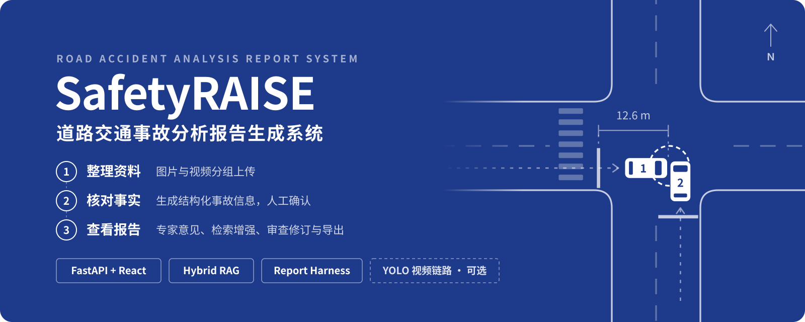

# SafetyRAISE



道路交通事故分析报告生成系统。

SafetyRAISE 提供从图片、视频材料到结构化事故信息、专家指导意见、检索增强报告和文书导出的工作流。仓库包含前后端、报告 Harness、部署模板与测试，不包含真实事故材料和知识库正文。

文档索引：

1. 本地启动： [快速开始](docs/quickstart.md)
2. 配置模型、知识库与上传限制： [配置说明](docs/configuration.md)
3. 运行时资产说明： [运行资产准备](docs/prepare-runtime-assets.md)
4. 服务器部署： [部署说明](docs/deployment.md)

## 核心能力

1. 固定八个分组的资料编排台，用于统一整理事故材料并生成事故草稿。
2. 图片和视频上传、事故草稿编辑保存及会话恢复；限额由 `input_generation.upload` 配置。
3. 视频处理链路完整接入 `YOLO + ByteTrack + 自适应抽帧 + 视觉模型`。
4. 专家指导、知识检索、报告生成及后处理；生产检索默认使用本地稀疏与稠密索引。
5. 报告 Harness 在原报告链路之外提供证据快照、独立审查与修订、预算、审计与恢复能力；服务端未显式装配时保持关闭，旧报告链路不变，演示模式下未通过独立审查的稿件带标记导出、不作为正式发布。
6. 中间产物支持预览，包含：
   - 知识片段
   - 模型自主搜索关键词
   - YOLO 完整输出
   - 结构化事故信息
   - 图片与关键帧
7. 视觉、报告、嵌入模型按用户能力配置解析；专家模型为系统级能力，不出现在用户模型配置界面。配置优先级与兼容规则见 [配置说明](docs/configuration.md)。
8. 后端支持 `report.md / report.docx / report.pdf` 导出。
9. 内置用户体系：用户名密码登录 + 注册、管理员/普通用户角色、仅管理员可见的用户、空间与报告质量反馈管理控制台。
10. 用户和会话按账户隔离，前端缓存按用户分桶。

## 处理链路

```text
事故图片/视频材料
    -> 事故信息草稿
    -> 专家指导意见
    -> 检索增强分析报告
    -> 导出文书
```

## 技术栈

1. 前端：React + TypeScript + Vite
2. 后端：FastAPI
3. 视频链路：YOLO、ByteTrack、ffmpeg
4. 检索链路：本地知识库文件 + embedding + 稀疏/稠密混合 RRF（reranker 可选，服务器默认停用）
5. 账户与数据：PostgreSQL（用户、会话、每用户模型配置）
6. 原生加速：Rust（分词 / 打分 / JSON 候选提取）
7. 部署目录：`deployment/docker`（同机部署及受控双机部署模板）

## 仓库结构

```text
SafetyRAISE-OS/
├─ .github/              CI 与 issue / PR 模板
├─ backend/              FastAPI 后端、报告 Harness、配置与测试（backend/tests）
├─ frontend/             React 前端与浏览器测试（frontend/tests）
├─ deployment/
│  ├─ docker/            同机与分机部署模板、Nginx 与证书续期脚本
│  └─ modal/             专家模型的 Modal 部署脚本
├─ docs/                 开发与部署文档
├─ examples/kbase/minimal/  无正文的知识库结构模板
└─ .env.example          服务器部署环境变量示例
```

## 运行前准备

使用前需自行准备以下依赖：

1. 模型服务
   - 专家模型
   - 视觉模型
   - 报告模型
   - embedding 模型
2. 非空知识库正文与索引。`examples/kbase/minimal/` 仅提供无正文的目录和文件结构，不能用于生成可引用的报告；完整 Harness 会拒绝空知识资产。
3. 视频依赖
   - `ffmpeg / ffprobe`
   - YOLO 权重
4. 若使用远端模型服务，对应的 API Key

## 本地开发

依赖安装（Windows 下解释器路径为 `.venv/Scripts/python.exe`，下同）：

```sh
uv venv .venv
uv pip install --python .venv/bin/python -r backend/requirements.txt
cd frontend
npm install
```

完整配置、数据库、模型接入和启动步骤见 [快速开始](docs/quickstart.md)。

## 文档入口

1. [配置说明](docs/configuration.md)
   - `workflow.yaml` / `workflow.server.yaml`
   - 模型配置、检索配置、上传限制
2. [运行资产准备](docs/prepare-runtime-assets.md)
   - 默认模型与端点
   - 配置入口
   - 知识库文件格式
   - `local_jsonl` 与 `hybrid_local`
   - 首次联调顺序
3. [部署说明](docs/deployment.md)：同机部署拓扑、发布、回滚、备份和健康检查。
4. [报告 Harness](docs/report-harness.md)：证据、独立审查、预算和恢复的运行契约。
5. [前端工作台](docs/frontend-workbench.md)：页面与接口边界。
6. [贡献指南](CONTRIBUTING.md)、[行为准则](CODE_OF_CONDUCT.md)、[安全策略](SECURITY.md)与[变更记录](CHANGELOG.md)。

## 验证

没有测试库时，先运行知识库相关的无数据库测试：

```sh
.venv/bin/python -m pytest -q backend/tests/unit/test_public_kbase_scaffold.py backend/tests/unit/test_knowledge_assets.py
```

完整后端测试（`backend/tests`，含单元测试与 PostgreSQL 集成用例）须先把 `REPORT_HARNESS_TEST_DSN` 指向**回环地址**上的独立可清理测试库，数据库名以 `safetyraise_harness_test` 开头；测试拒绝回退到业务库。准备好后运行：

```sh
.venv/bin/python -m pytest -q backend/tests
```

前端验证：

```sh
cd frontend
npm test
npm run build
```

空知识库模板只验证解析与失败边界；真实报告质量必须在私有知识资产、已批准的模型与独立验收条件下验证，不能由这些测试推断。

## 许可

本项目采用 [Apache License 2.0](LICENSE)。可选的视频链路依赖 `ultralytics` 及其 YOLO 权重采用 AGPL-3.0（或 Ultralytics 企业许可），不随本仓库分发；安装、分发包含它们的镜像或以网络服务形式提供时，需要自行履行相应许可义务，详见 [NOTICE](NOTICE)。
